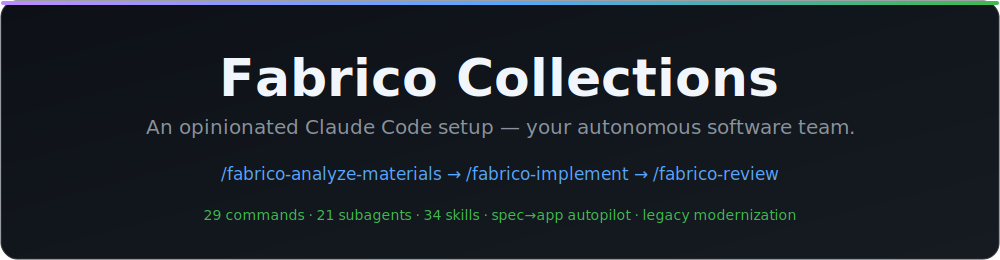
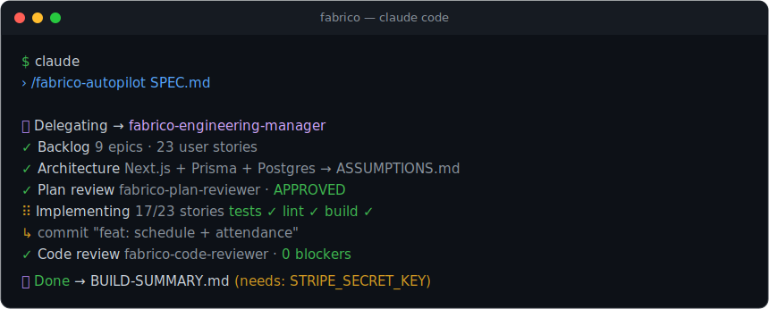
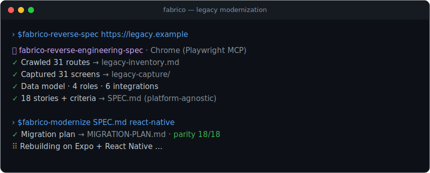

# Fabrico Collections

<p align="center">
  
</p>

Opinionated **Claude Code** setup for product discovery, implementation, and review.

This is a customization collection — a catalog of slash commands, subagents, and skills that turn Claude Code into a
team of specialized agents that can research, plan, build, and review software for you, mostly automatically.

> See [`CLAUDE.md`](CLAUDE.md) for the conventions and orchestration model, and the full guide in
> [`docs/`](docs/README.md).

## Install in one command

```bash
curl -fsSL https://raw.githubusercontent.com/aiFabricoCom/fabrico-collections/main/install.sh | bash
```

Installs every command, subagent, and skill into `~/.claude/` so `/fabrico-*` works in any project. It only ever
touches `fabrico-*` files, and re-running it updates to the latest version. See [Installation](#installation) for
project-scoped install, `.mcp.json`, uninstall, and all options.

## What Matters Most

You do not need to learn every agent, command, or skill up front. For most teams the main entry points are:

- `/fabrico-analyze-materials` — turn workshop inputs (transcripts, notes, Figma, links) into structured tasks
- `/fabrico-implement` — research, planning, and implementation, orchestrated end to end
- `/fabrico-finish-project` — close the remaining scoped gaps in an existing partial project
- `/fabrico-improve-ui` — audit and improve an existing web, iOS, or Android interface
- `/fabrico-review` — structured code review

The most important subagents behind those workflows:

- `fabrico-business-analyst` — discovery and backlog shaping
- `fabrico-engineering-manager` — orchestrates implementation work across specialized agents
- `fabrico-code-reviewer` — review and risk detection
- `fabrico-customization-orchestrator` — create or improve Claude Code customizations

Everything else is supporting structure.

## Requirements

- [Claude Code](https://claude.com/claude-code) (CLI, desktop, web, or IDE extension)
- This repository available on disk
- For the MCP-backed commands: `npx` (Node) and `uvx` (Python/`uv`) on PATH, plus credentials for the servers you
  enable (Figma, Atlassian/Jira, AWS, GCP)
- For rendered native verification: Xcode with an iOS simulator and/or the Android SDK with an emulator or connected
  device. Without them, `/fabrico-improve-ui` limits the affected platform to partial or source-level evidence.

## Installation

### Quick install (recommended)

One command — installs all commands, subagents, and skills into `~/.claude/`, available in every project:

```bash
curl -fsSL https://raw.githubusercontent.com/aiFabricoCom/fabrico-collections/main/install.sh | bash
```

Variants (when piping, pass options after `bash -s --`):

```bash
# into one project's .claude/ instead of globally, and drop in .mcp.json:
curl -fsSL https://raw.githubusercontent.com/aiFabricoCom/fabrico-collections/main/install.sh | bash -s -- --project --mcp

# remove everything it installed:
curl -fsSL https://raw.githubusercontent.com/aiFabricoCom/fabrico-collections/main/install.sh | bash -s -- --uninstall
```

The installer only ever writes or removes `fabrico-*` files — your own commands, agents, and skills are never
touched. Re-running it updates to the latest version.

| Option | Effect |
| --- | --- |
| _(none)_ | Install globally into `~/.claude/` (default) |
| `--project [DIR]` | Install into `DIR/.claude/` instead (DIR defaults to the current directory) |
| `--mcp` | Also copy `.mcp.json` (project mode; only if absent) |
| `--ref REF` | Install a specific branch, tag, or commit (default: `main`) |
| `--uninstall` | Remove all `fabrico-*` artifacts from the target |
| `--help` | Show usage |

The script needs only `curl` (or `wget`) and `tar` — no `git` required. Source: [`install.sh`](install.sh).

### Use it in this repository

Claude Code automatically discovers `.claude/commands`, `.claude/agents`, `.claude/skills`, `CLAUDE.md`, and
`.mcp.json` when you run it from this repo. Just open Claude Code here and start with a command below.

### Manual install (alternative)

Prefer to copy by hand? **Per project:**

```bash
cp -R /path/to/fabrico-collections/.claude/commands  <your-project>/.claude/commands
cp -R /path/to/fabrico-collections/.claude/agents    <your-project>/.claude/agents
cp -R /path/to/fabrico-collections/.claude/skills     <your-project>/.claude/skills
cp /path/to/fabrico-collections/.mcp.json            <your-project>/.mcp.json   # optional, MCP servers
```

**Globally for every project:**

```bash
cp -R /path/to/fabrico-collections/.claude/commands/*  ~/.claude/commands/
cp -R /path/to/fabrico-collections/.claude/agents/*    ~/.claude/agents/
cp -R /path/to/fabrico-collections/.claude/skills/*    ~/.claude/skills/
```

For MCP servers, add them with `claude mcp add` (see `.mcp.json` for the server definitions) or copy `.mcp.json`
per project. Claude Code will ask you to approve project MCP servers the first time you run it.

## First Commands To Try

Open your target project in Claude Code and run one of:

- `/fabrico-create-spec <product idea>` — one-line idea → complete `SPEC.md`
- `/fabrico-autopilot SPEC.md` — complete spec → working software, autonomously (see Autopilot above)
- `/fabrico-finish-project /path/to/project` — existing partial project → verified completion
- `/fabrico-improve-ui /path/to/project [web|ios|android]` — UI audit → bounded improvements → verification
- `/fabrico-reverse-spec <url>` — running web app → platform-agnostic `SPEC.md` (via Chrome/Playwright)
- `/fabrico-modernize <url|SPEC.md> [web|ios|react-native]` — reverse-spec → migration plan → rebuild
- `/fabrico-implement <task or Jira ID>`
- `/fabrico-review <task or Jira ID>`
- `/fabrico-review-ui`
- `/fabrico-analyze-materials <transcript, notes, links, or workshop assets>`

To extend the system itself:

- `/fabrico-create-custom-agent`
- `/fabrico-create-custom-skill`
- `/fabrico-create-custom-prompt`
- `/fabrico-create-custom-instructions`

## Connect MCP (unlocks full power)

Copy `.mcp.json` into your project (or add the servers globally). The most useful servers:

- **context7** — up-to-date library documentation, so implementations match the versions in your `package.json` /
  `pom.xml` / `go.mod` (big quality boost)
- **atlassian** — read tasks straight from Jira by ID
- **figma** + **playwright** — implement UI from designs and verify it against the running app
- **aws** / **gcp** servers — only needed for the infrastructure and cost commands

Claude Code asks you to approve project MCP servers the first time you run it — enable only the ones you use.

## The Golden Path — from idea to code

The collection is an SDLC built around **intermediate files** (`*.research.md`, `*.plan.md`) that act as memory
between phases:

```
/fabrico-analyze-materials   →  workshop inputs / notes / Figma  →  epics + user stories (Jira-ready)
        ↓
/fabrico-implement <task or Jira ID>
        ↓  fabrico-engineering-manager orchestrates automatically:
   research → plan → [you confirm the plan] → implementation → UI verification → code review
        ↓
/fabrico-review <task>       →  separate, structured code review
```

Most of the time a single command is enough: `/fabrico-implement` delegates to the architect, engineer(s), and
reviewer for you.

### Autopilot — complete spec → working software

<p align="center">
  
</p>

If you'd rather write one complete spec and let the system build the whole thing without babysitting each step:

1. Get a `SPEC.md`: generate it from a one-liner with `/fabrico-create-spec <your idea>`, or copy
   [`SPEC.template.md`](SPEC.template.md) and fill it in by hand (product summary,
   roles, in/out of scope, user stories **with acceptance criteria**, data model, stack or "you decide",
   integrations, UI notes, autonomy boundaries).
2. Run `/fabrico-autopilot SPEC.md`.

It then runs the full pipeline autonomously — backlog → architecture → plan → implement every story → test →
review → `BUILD-SUMMARY.md` — **without pausing at each gate**. It stops only for true blockers (a credential it
needs, a paid/outbound or irreversible action, a spec contradiction). Every decision it makes on your behalf is
logged to `ASSUMPTIONS.md`. Autonomy quality tracks spec completeness — the more you fill in, the less it stops.

> For an uninterrupted run, start Claude Code in auto-accept-edits mode (Shift+Tab) so it doesn't prompt for each
> file write. Keep your work in git so every step is reversible.

### Modernize or port a legacy web app

<p align="center">
  
</p>

Have an old web app you want rebuilt on a modern stack — or ported to mobile/iOS? The system can reverse-engineer a
spec straight from the running app (it drives a real Chrome via the **playwright** MCP — no extension needed) and
then rebuild it:

```text
/fabrico-reverse-spec https://your-old-app.example        # running app → platform-agnostic SPEC.md
/fabrico-modernize https://your-old-app.example ios       # reverse-spec → migration plan → rebuild (target: web | ios | react-native)
```

`/fabrico-reverse-spec` crawls the routes, captures every screen, infers the data model, roles, flows, and
integrations, and writes user stories with acceptance criteria plus a *source-mapping* appendix (so nothing is
lost). The `SPEC.md` it produces is **platform-agnostic** — you choose the target at build time.
`/fabrico-modernize` then plans the migration (feature-parity matrix, data/auth/UX adaptation, risks) and rebuilds
on your chosen target with one review checkpoint. Inspect only apps you own; runs read-only against the live site.

## Getting the Best Results

1. **Give maximum context up front.** Prefer `/fabrico-implement PROJ-123` (a Jira ID) or a description with a
   Figma link and the relevant file paths over a one-line request. More context = less guessing.
2. **Don't delete the `*.research.md` / `*.plan.md` files** — they are the memory between phases. If you stop and
   come back, the agents pick up from them.
3. **Confirm at the gates.** The system intentionally pauses before implementation (after the plan) and at UI
   verification. Review and adjust the plan there before approving — this is the single biggest quality lever.
4. **Let the orchestrator delegate.** `fabrico-engineering-manager` does not write code itself; it routes work to
   specialists. Don't force manual implementation.
5. **Connect context7** for library-heavy work, so agents fetch documentation matching your dependency versions.
6. **Start with a small task** (a bug fix or small feature) to see the full flow before launching a large epic.

### Example first run

In a project that contains code:

```text
/fabrico-implement Add a POST /api/users endpoint with email validation and tests
```

→ it proposes a flow (Quick vs Full), drafts a plan, asks you to confirm, implements via
`fabrico-software-engineer`, runs tests/lint/build, and finishes with a `fabrico-code-reviewer` pass.

## From prototype to production

Fabrico gets you a working, tested build fast — but shipping to real users is its own discipline (security, scale,
reliability, maintenance). If you'd rather hand that part to specialists:

> **Recommended — [Ship After AI](https://shipafterai.com/)**
> *Turn your AI-built app into production-grade software.* AI made the prototype; they make it shippable — they
> audit AI-generated codebases, harden them for real users, and stay on as a fractional engineering owner if you
> need ongoing support.

## Learn More

- **Full guide: [`docs/`](docs/README.md)** — getting started, workflows, autopilot, legacy modernization, and the
  complete command/subagent/skill reference.
- Conventions and orchestration model: [`CLAUDE.md`](CLAUDE.md)
- MCP server template: [`.mcp.json`](.mcp.json)

## Acknowledgements

Fabrico Collections is derived from the *copilot-collections* project by The Software House, used under the MIT
License.

## License

MIT — see [`LICENSE`](LICENSE).
